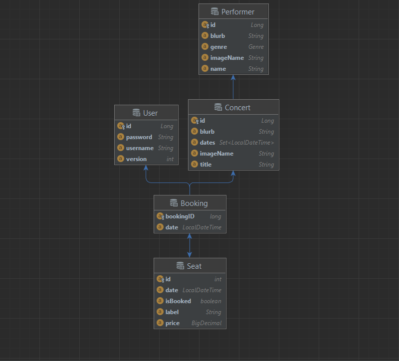

# Organisation

## Our Team

Caleb Ko:
- Concert Domain Model
- Seat Domain Model
- ConcertResource.Java
- Error Testing

Jacob Watson
- Booking Domain Model
- Performer Domain Model
- Mappers
- Error Testing

Samuel Dosado
- User Domain Model
- File Structure
- ConcertResource.Java
- Error Testing

## Strategies used to minimise the chance of concurrency errors
We have tried to minimise the chance of concurrency errors by ensuring that all objects in the data have an individual ID

For users private information we have a version associated with the login information for each user

We tried to implement asynchronous web services which wasn't successful

## Domain Model Organisation
